# skillmeter

**Claude Code gives every skill you install a shared 2,000-token budget — about 1% of
the context window. Two popular packs use 1,999 of it.**

That budget holds the name and description of *every* installed skill, and you pay it
on every session before you type a word. Go over and descriptions start getting
dropped. The agent still sees the name. It just can't tell what the skill is for.

<p align="center">
  
</p>

<p align="center">
  <sub><b>obra/superpowers + anthropics/skills</b>, then <b>managedcode/dotnet-skills</b> added — three packs, cloned 2026-07-25.</sub>
</p>

```
$ skillmeter

  32 skills   1,999 tokens of listing metadata
  budget: 2,000 tokens  (1.0 % of a 200,000-token window)

  Within budget. 1 token of headroom (0% remaining).
  Close to the edge — the next pack you install will start evicting skills.
```

So install one more — a real, actively-maintained catalog of 179 skills:

```
$ skillmeter --path ./dotnet-skills

  175 skills   23,294 tokens of listing metadata
  budget: 2,000 tokens  (1.0 % of a 200,000-token window)

  OVER BUDGET by 21,294 tokens — 11.6x the allowance.

  24 skills keep their description.
  151 go dark — the agent sees a name it cannot route to.
```

One 5 MB binary. No runtime, no daemon, no API key, no network — ever.

## Install

```bash
npx skillmeter                      # no install
npm install -g skillmeter           # npm
dotnet tool install -g skillmeter   # NuGet
```

Cold start is about **3 ms**.

## Use

```bash
skillmeter                       # what your installed skills cost
skillmeter cost --top 40         # the 40 most expensive, dearest first
skillmeter ./some-pack           # measure a pack before you install it
skillmeter roots                 # every location scanned
skillmeter --json                # versioned JSON for scripts and CI
```

Gate a pull request on it:

```yaml
- run: npx skillmeter --fail-on 2000
```

Or with the action, which needs no runtime on the runner — it fetches the native binary directly:

```yaml
- uses: nirajpant07/skillmeter@v0.1.0
  with:
    fail-on: 2000
    strict: true
```

It exposes `metadata-tokens`, `budget-multiple`, `skills-going-dark` and `over-budget` as outputs, and writes the report to the job summary.

Pack maintainers can put the number in their own README with a badge — green under budget, red over, straight from the outputs:

```yaml
- uses: nirajpant07/skillmeter@v0.1.0
  id: sm
- run: |
    echo "https://img.shields.io/badge/skill%20listing-${{ steps.sm.outputs.metadata-tokens }}%20%2F%202000%20tokens-${{
      steps.sm.outputs.over-budget == 'true' && 'critical' || 'success' }}"
```

Exit codes: `0` ok, `1` gate failed, `2` usage error, `3` runtime error.

Note that `1` is only ever returned when you ask for a gate — with `--fail-on`, `--fail-over-budget` or `--strict`. A plain `skillmeter` run reports and exits `0` however far over budget you are.

If any path can't be read — an unreadable `SKILL.md`, a permission-denied subtree — skillmeter says so, in both output modes, and marks the totals as a lower bound. That matters most in CI, where measuring *less* than reality would otherwise let a gate pass because the scan failed:

```yaml
- run: npx skillmeter --fail-on 2000 --strict
```

## What it measures

Skills load in three layers. Most tools count none of them; `skillmeter` counts all three.

| Layer | When you pay | What it is |
|---|---|---|
| **listing metadata** | **every session** | name + description of *every* installed skill |
| **activation** | when a skill fires | the SKILL.md body |
| **resources** | on demand | bundled `references/` and `assets/` |

Only the first is capped, and it is the one nobody watches. Measured across four popular packs: 235 skills, of which 231 enter the listing — **26,592 tokens against a 2,000-token budget, 13.3x over**, with 503,605 more tokens of bodies and 1,257,905 tokens of bundled resources behind them. (Skills marked `disable-model-invocation` never enter the listing and are excluded.)

> **Provenance.** All figures on this page come from packs re-measured **2026-07-27**:
> `obra/superpowers` (`3dcbd5c`), `anthropics/skills` (`b29e7cf`),
> `addyosmani/agent-skills` (`7829ffd`), `managedcode/dotnet-skills` (`902c435`).
> The paragraph above measures all **four**. The demo at the top of this page measures
> **three** of them — it omits `agent-skills` — which is why it reads 25,293 tokens and
> 12.6x rather than 26,592 and 13.3x. Both are correct; they are different pack sets,
> not different days.
>
> Per-pack numbers, refreshed weekly against current pack HEADs, are in the
> **[skill pack cost index](docs/cost-index.md)**.

## Cross-agent

Scans every standard location, not just Claude Code's:

```
.agents/skills/          .claude/skills/         .cursor/skills/
.github/skills/          .gemini/skills/         ~/.codex/skills/
~/.config/agents/skills/
```

`.agents/skills/` is read natively by Copilot, Codex, Cursor and Amp, and as an alias by Gemini CLI. Run `skillmeter roots` to see exactly what is searched on your machine.

## How it compares

| | inventory | runtime firing | **cost** | JSON | Windows | deps |
|---|:--:|:--:|:--:|:--:|:--:|:--:|
| `skillsight` | yes | — | — | yes | ? | node |
| `skilltrace` | yes | yes | — | — | no | ~20 npm |
| **skillmeter** | yes | — | **yes** | yes | **yes** | **none** |

`skillsight` tells you what you have. `skilltrace` tells you what fired. Neither tells you what it costs.

## Honest caveats

**The tokenizer is a proxy.** Counts use `o200k_base`, embedded in the binary. Anthropic publishes no offline tokenizer for current Claude models, so this is close but not exact — measured at 4.5–4.9 characters per token on real skill descriptions. (The `chars/4` heuristic other tools use over-counts by roughly 19%; compare for yourself with `--tokenizer approx`.) Absolute numbers are good estimates; comparisons between skills are reliable.

**Frontmatter parsing is verified against a real YAML parser.** Across the 235-skill corpus, `skillmeter`'s hand-rolled reader agrees with PyYAML on every skill — 0 tokens of difference. It is a deliberate subset of YAML, not a full implementation: anchors, aliases, tags, flow collections and multi-document files are unsupported, because the spec's field set never uses them.

**"Skills going dark" is a best case.** Claude Code evicts least-used first. That needs runtime data `skillmeter` doesn't collect, so it reports the most favourable ordering — the real number is never better than shown.

**Claude Code isn't silent about this.** It writes a warning to the debug log, and `/doctor` gives an estimate. What it doesn't give you is per-skill attribution, a cross-agent view, machine-readable output, or something you can fail a build on.

**Defaults are Claude Code's**, and configurable: `--window`, `--fraction`, `--max-desc-chars`. For a 1M-token window, `skillmeter --window 1000000`.

## Read-only, always

`skillmeter` never writes to, installs into, or modifies any agent configuration. It opens files for reading and prints a report. That is the whole of its interaction with your machine.

## Contributing

Please read [CONTRIBUTING.md](CONTRIBUTING.md) first — it is short, and it sets expectations honestly about scope and response times.

## Licence

MIT. See [LICENSE](LICENSE).
